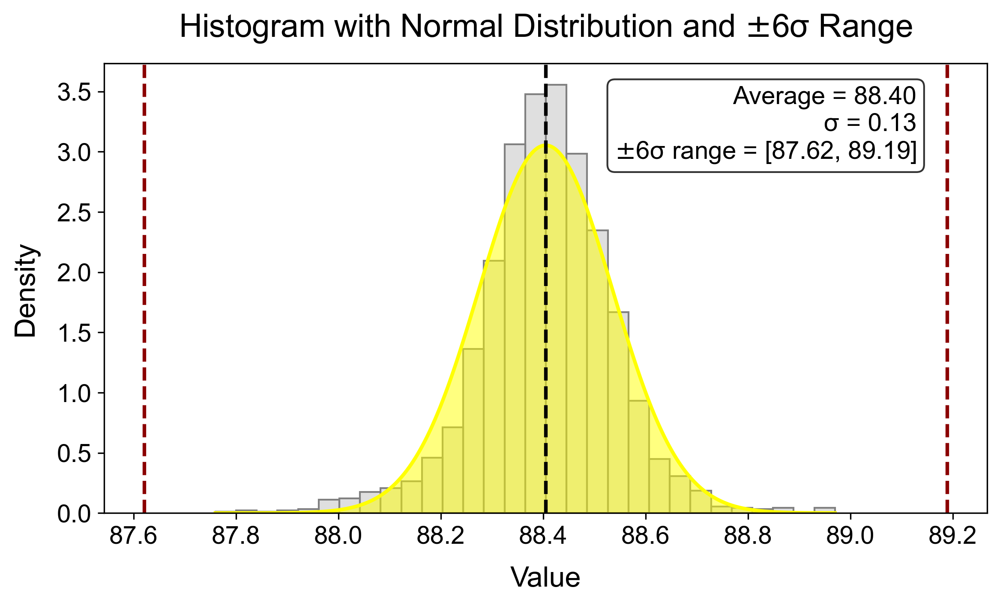
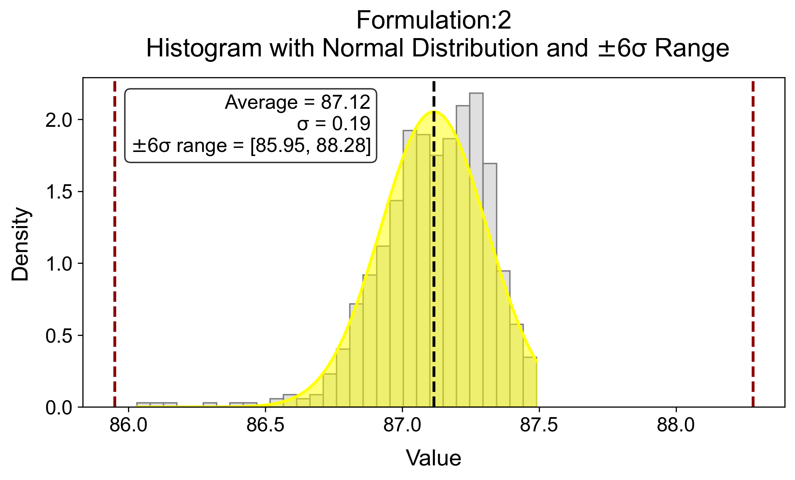

# Statistical Data Analysis — 6σ Histogram (Mval_02)

This project loads measurement data from a CSV file, cleans and filters it based on chemical composition and process parameters, calculates ±6σ statistics for two formulations, and visualizes the results using a histogram overlaid with the mean and ±6σ limits.

## Overview

The script performs the following steps:

1. Loads `Data.csv` and removes empty rows/columns.
2. Splits the data into **Parameters** (`Set` → `Parameter_10`, kept as strings) and **Values** (`Mval_01.1` → the column before `Remarks`, converted to numeric).
3. Merges the parameter and value data back into a single DataFrame.
4. Filters rows belonging to two formulations based on `Chem1`/`Chem6` combinations.
5. Applies further filtering on `Chem4` and `Parameter_2`–`Parameter_6`.
6. Relabels the matched chemical codes into readable formulation names:
   - `CHM856-810`
   - `CHM553-909`
7. Splits the filtered data into `df_CHM856` and `df_CHM553`.
8. For Formulation 1 (`df_CHM856`), restricts `Mval_02` to `87 < Mval_02 < 89`.
9. Calculates mean, standard deviation, and ±6σ limits of `Mval_02`.
10. Plots a histogram with the mean and ±6σ lines, plus a statistics text box.

## Project Structure

```text
.
├── Data.csv
├── Stat_01.ipynb
├── StatisticalPlot.png
└── README.md
```

---

## Screenshots





---

## License
This project is currently available for personal or internal use.

If you would like to distribute or modify the project, add an appropriate open-source license, such as the MIT License.

Author
Created by **Brindaban Kundu**

GitHub:  https://github.com/BrindabanKundu